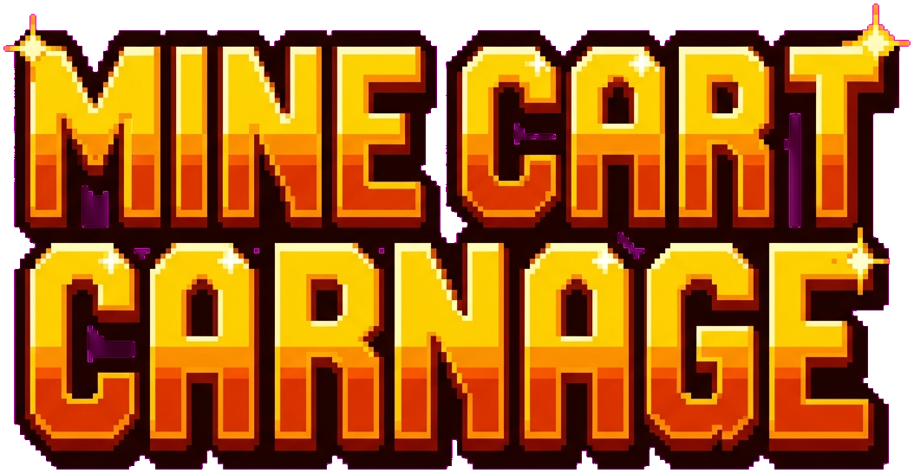

<div align="center">



### An endless mine-cart runner. Pixel-art tribute to the SNES classic.

[](https://kabronero.github.io/mine-cart-carnage/)

[](https://developer.mozilla.org/en-US/docs/Web/HTML/Element/canvas)
[](#)
[](#)
[](#)
[](#)
[](https://claude.com/claude-code)
[](LICENSE)

</div>

---

## What is it?

A browser-playable, mobile-friendly endless runner inspired by the iconic
**Mine Cart Carnage** level from *Donkey Kong Country* (SNES, 1994).
Hold the screen to jump. Collect bananas. Build combos. Don't fall.

Single `index.html` file, zero build step, plays anywhere a modern browser
runs. Mobile-first but feels great on desktop too.

## Features

- 🎢 **Procedural mine-cart track** with 6 segment types: flat, slopes,
  gaps, stacked twin rails, valleys, oncoming carts
- 🍌 **Bananas + mega-bananas** with fly-to-counter pickup animation
- 🎯 **Combo system**: score multiplier that grows with banana streaks,
  with milestone celebrations at every x10
- 🦘 **Analog jump**: hold longer = jump higher (variable gravity)
- 🐊 **Kremling-style enemies** that ride toward you on parallel rails
- 💥 **TNT barrel explosions** with hand-painted boom sprite
- 🎵 **Synthesized chiptune** soundtrack (Web Audio, no samples) that
  layers in extra parts as your combo climbs
- 📱 **Real portrait mode**: the canvas resizes and the layout adapts,
  not just letterboxed landscape
- 🎨 **AI-generated 16-bit pixel art** sprites with proper alpha-keyed
  PNGs (Vision framework + magenta chroma-key pipeline)
- 📺 **CRT scanline overlay** for retro CRT vibes
- 💾 **localStorage** high-score persistence

## Controls

| Action | Desktop | Mobile |
|---|---|---|
| Jump | `Space` / `↑` / `W` | Tap and hold the screen |
| Higher jump | Hold the key longer | Hold the screen longer |
| Toggle music | `M` | n/a |

## Tech

- **HTML5 Canvas** for everything
- **Vanilla JavaScript**, no framework, no build step
- **Web Audio API** for synthesized chiptune music + SFX
- **localStorage** for high-score persistence
- **Sprite pipeline** (in [`scripts/`](scripts/)):
  - Sprites generated with Google's Nano Banana (Gemini 2.5 Flash Image)
  - Backgrounds removed with macOS Vision framework via a small Swift script
  - Magenta chroma-key fallback for assets where Vision over-keys (logo)
  - Python helpers to harden alpha, fill interior holes, and erase wheel
    wells so we can overlay rotating wheel sprites

## Local development

```bash
# Just open the file
open index.html

# Or run a local server (recommended for sprite loading)
python3 -m http.server 8765
# → http://localhost:8765
```

That's it. There's no build step.

## Project structure

```
mine-cart-carnage/
├── index.html           # the entire game
├── assets/              # sprites, logo, cave background
└── scripts/             # one-shot pipeline tools (Node, Python, Swift)
```

## Credits & disclaimer

Inspired by *Donkey Kong Country* (Rare / Nintendo, 1994). All sprites and
audio in this project are original (generated or synthesized) and the
character design intentionally avoids reproducing Nintendo's IP. This is a
fan-made tribute, not affiliated with or endorsed by Rare or Nintendo.

Built collaboratively with [Claude Code](https://claude.com/claude-code).

## License

MIT. See [LICENSE](LICENSE).
